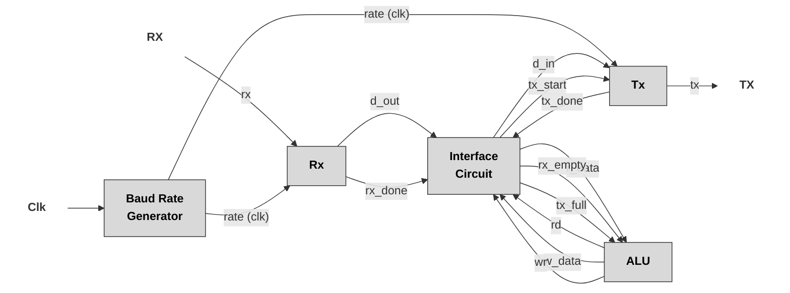

```mermaid
graph LR
%% Clases para simular el sombreado de los bloques
classDef block fill:#d9d9d9,stroke:#333,stroke-width:1px,color:#000,font-weight:bold;
classDef io fill:none,stroke:none,font-weight:bold;

%% Puertos externos
RX_in[RX]:::io
Clk_in[Clk]:::io
TX_out[TX]:::io

%% Bloques principales
BRG["Baud Rate<br>Generator"]:::block
Rx["Rx"]:::block
Tx["Tx"]:::block
IC["Interface<br>Circuit"]:::block
ALU["ALU"]:::block

%% Conexiones de Entrada y Baud Rate Generator
Clk_in --> BRG
RX_in -- "rx" --> Rx

%% La señal rate actúa como clk para Rx y Tx
BRG -- "rate (clk)" --> Rx
BRG -- "rate (clk)" --> Tx

%% Conexiones entre Rx y el Circuito de Interfaz
Rx -- "d_out" --> IC
Rx -- "rx_done" --> IC

%% Conexiones entre Tx y el Circuito de Interfaz
IC -- "d_in" --> Tx
Tx -- "tx_done" --> IC
IC -- "tx_start" --> Tx

%% Salida de Tx
Tx -- "tx" --> TX_out

%% Conexiones entre el Circuito de Interfaz y la ALU (Lectura)
IC -- "r_data" --> ALU
ALU -- "rd" --> IC
IC -- "rx_empty" --> ALU

%% Conexiones entre el Circuito de Interfaz y la ALU (Escritura)
ALU -- "w_data" --> IC
ALU -- "wr" --> IC
IC -- "tx_full" --> ALU
```
